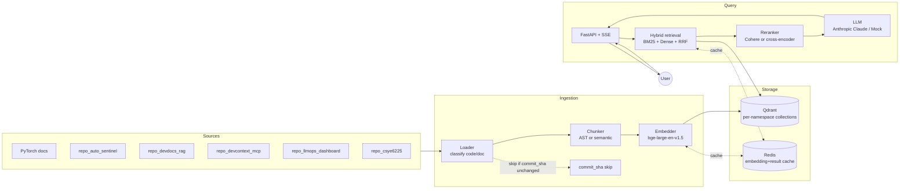
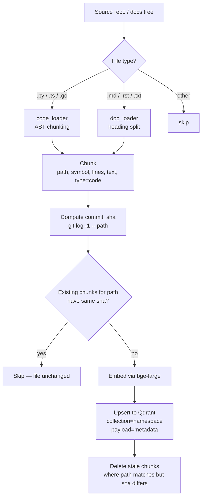
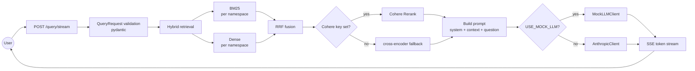
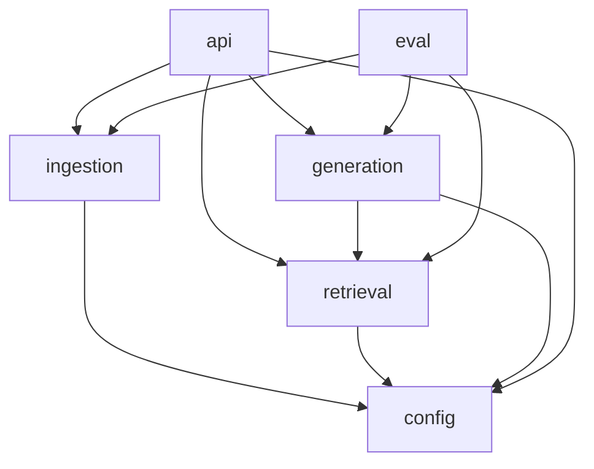

# Architecture

This is the long-form companion to [README.md](README.md). It captures the
diagrams and the decision log. **Update this file when a design decision
changes** — see CLAUDE.md DON'T #5.

---

## 1. System overview



---

## 2. Ingestion flow



**Per-chunk payload** (Qdrant point):

```json
{
  "namespace": "repo_csye6225",
  "path": "src/auth/cognito.py",
  "symbol": "refresh_token",
  "chunk_type": "code",
  "language": "python",
  "start_line": 42,
  "end_line": 78,
  "commit_sha": "a1b2c3d4...",
  "indexed_at": "2026-04-28T18:00:00Z",
  "text": "def refresh_token(...): ..."
}
```

---

## 3. Query flow



---

## 4. Module dependency map



A module **imports only from a module's top-level interface**, never from a
sibling's submodule. This is enforced by code review (and eventually by an
import linter).

---

## 5. Data model (cross-cutting)

| Object | Defined in | Why it's a Pydantic model |
|---|---|---|
| `Settings` | `config.py` | Single env-loading source of truth |
| `QueryRequest`, `HealthResponse` | `api/main.py` | Public API contract |
| `LLMMessage` | `generation/llm_client.py` | Crosses generation ↔ api boundary |
| `RetrievedChunk` | `retrieval/hybrid.py` | Crosses retrieval ↔ generation boundary |
| `CodeChunk`, `DocChunk` | `ingestion/loaders/*` | Cross loader → pipeline boundary |
| `IngestionReport` | `ingestion/pipeline.py` | Returned to caller (CLI / API) |

---

## 6. Decision log

Every entry: **decision · alternatives considered · why this · when revisit**.

### D1 — Qdrant for vector storage

- **Alternatives**: pgvector, Weaviate, Chroma, Milvus.
- **Why Qdrant**: best payload-filter performance, native multi-namespace via
  collections, `--storage-path` makes self-hosted dev trivial.
- **Revisit**: if we cross 100M chunks (we won't) or need SQL joins on payload.

### D2 — Hybrid (BM25 + dense), not dense-only

- **Alternatives**: dense-only with `bge-large`, or sparse-only with BM25.
- **Why hybrid**: code retrieval *requires* exact-symbol recall (e.g.
  `register_buffer`) that pure embeddings smooth away. Hybrid + RRF is a
  well-known answer.
- **Revisit**: if we add ColBERT/SPLADE — those would replace BM25.

### D3 — RRF (k=60) for fusion

- **Alternatives**: weighted score sum, learned reranker as fusion.
- **Why RRF**: parameter-free across retrievers with very different score
  distributions. k=60 is the literature default.
- **Revisit**: if a learned ranker beats it on the golden set.

### D4 — Cohere Rerank (prod) + cross-encoder fallback

- **Alternatives**: only cross-encoder, only LLM-as-reranker.
- **Why Cohere prod**: ~100ms p50 for top-50, quality is excellent for
  top-5 selection. Cross-encoder local removes the API dependency for offline
  use.
- **Revisit**: if Cohere pricing changes or a stronger open-weight reranker
  ships.

### D5 — AST chunking for code, heading-aware for docs

- **Alternatives**: fixed-window for everything, semantic-only.
- **Why AST**: a function/class is the natural unit of meaning in code; a
  retrieved chunk should be runnable. Headings carry structure in markdown.
- **Revisit**: if we add notebook (.ipynb) support — needs a different
  splitter.

### D6 — `bge-base-en-v1.5` (768-d) as base embedder

- **Alternatives**: `text-embedding-3-large` (OpenAI), `bge-large` (1024-d),
  `bge-small`, `e5-large`.
- **Why bge-base** (updated 2026-04-28, was bge-large): open weights, strong
  on technical English, license-clean for self-host. **MTEB delta vs bge-large
  is ~0.7**; the 3× model-size win matters on M3 Air with 16 GB (thermal +
  RAM headroom for Qdrant + IDE). Phase 5 fine-tunes `bge-small` and shows
  the comparison.
- **Revisit**: when a clear successor ships with measurable recall gains.

### D7 — Phase 1 ships a mock LLM behind a Protocol

- **Alternatives**: skip the API surface until Phase 3.
- **Why mock**: lets us prove the SSE plumbing, FastAPI wiring, and CI
  pipeline before paying for tokens. The Protocol guarantees the real client
  drops in without a refactor.
- **Revisit**: never — this is a Phase-1-only artifact, deleted in Phase 3
  (the `MockLLMClient` stays for tests; the *default* swaps).

### D8 — Per-file `commit_sha` for incremental indexing

- **Alternatives**: hash file content, hash mtime, full re-index.
- **Why commit_sha**: stable across machines, deterministic for unchanged
  files even if mtime changes (e.g. fresh clone), no need for a separate
  manifest.
- **Revisit**: if we ever index files that aren't in a git repo (we won't).

### D9 — Streamlit for the demo UI

- **Alternatives**: Next.js, plain HTML.
- **Why Streamlit**: zero-frontend-cost SSE consumer, fits the dogfood persona
  (one user — me).
- **Revisit**: when the portfolio matrix wants a unified Next.js frontend
  across all five projects.

### D10 — `uv` for dependency management

- **Alternatives**: poetry, pip-tools, plain pip.
- **Why uv**: fast, lockfile-by-default, single source of dep truth in
  `pyproject.toml`. Matches CI install path.
- **Revisit**: if uv stops being the consensus.

### D11 — Qdrant payload indexes on namespace / file_path / commit_sha / chunk_type

- **Alternatives**: no payload indexes (linear filter scan), index everything.
- **Why these four**: the incremental-indexing algorithm filters on
  `(namespace, file_path)` every run to fetch existing `commit_sha`. Query-time
  filters on `(namespace, chunk_type)` for "search only my code in repo X".
  Indexing other payload fields (`heading_path`, `symbol`, `level`) costs RAM
  for queries we don't run.
- **Revisit**: when we add full-text payload search ("show me chunks where
  heading_path contains 'autograd'") — that field gets a `text` index then.

### D12 — Qdrant is the checkpoint, not SQLite

- **Alternatives**: SQLite sidecar, JSONL manifest in `data/processed/`.
- **Why Qdrant**: it already holds `(file_path, commit_sha)` per chunk. A
  scroll over `with_payload=["file_path","commit_sha"]` reconstructs "what's
  done" in O(n_files) and is by definition consistent with what's actually
  indexed. A separate checkpoint store creates a second source of truth that
  can drift from Qdrant on crash.
- **Revisit**: if `scroll_file_shas()` becomes a bottleneck at >1M chunks (it
  won't for the user's corpus). Then add a dedicated metadata collection.

### D13 — Phase 1 mock pipeline ships before Phase 2 real ingestion

- **Alternatives**: skip Phase 1, build retrieval against real data.
- **Why**: lets us prove FastAPI + SSE + CI + module boundaries with zero LLM
  cost and zero data dependencies. The `Embedder` / `LLMClient` / `Reranker`
  Protocols guarantee Phase 2/3 swap without callsite churn.
- **Outcome**: Phase 2 turned out to be a pure swap of two `get_*()`
  factories. No callsite changed. The Protocol design paid off.

### D14 — Qdrant server pinned to v1.13.6

- **Alternatives**: stay on v1.12.4 (Phase 1 default), bump to v1.16+ to fully
  match the locally-installed `qdrant-client` 1.17.x.
- **Why v1.13.x**: closes the v1.12.4 ↔ client v1.17.1 (5 minor) gap one
  step at a time. Conservative bump — no storage-format risk on existing
  data, and `docker compose pull && up -d` preserved all 2143 indexed
  points without re-ingestion.
- **Known residual**: client v1.17.1 still emits a warning against server
  v1.13.6 (4 minors apart, policy is ≤1). To fully clear the warning we'd
  need server v1.16.x or v1.17.x. Acceptable for now — functional behavior
  is unaffected.
- **Revisit**: when client crosses a major (v2.x) or when a future bump
  lands a feature we want (e.g. native sparse vectors for hybrid search,
  expected ~v1.15+).

### D15 — Per-namespace ignore-globs (gitignore-style)

- **Alternatives**: hard-coded skip-paths in the loader, a global ignore list
  shared across namespaces, full `.gitignore` parsing via `pathspec`.
- **Why per-namespace dict**: PyTorch docs need to skip Sphinx build
  scripts (`docs/source/scripts/**`); user-repo namespaces will need
  different patterns (`node_modules/**`, `__pycache__/**`, `dist/**`,
  `*.lock`). A `dict[namespace, list[glob]]` in `Settings` keeps that
  per-namespace tailoring without code changes.
- **Why our own glob matcher** (not `pathspec`): minimal surface area —
  `**` for recursive segments + `fnmatch` for single-segment wildcards
  covers our needs in ~25 lines and one stdlib import. Adding `pathspec`
  would buy full gitignore semantics (negation, `!`, anchored slashes)
  we don't have a use case for. Tested in `tests/test_state.py` against
  11 representative cases.
- **Outcome**: 10 Sphinx-helper-script chunks removed from
  `pytorch_docs` (2143 → 2133). The matcher is the same one user-repo
  namespaces will use in Phase 4.
- **Revisit**: if we hit a pattern we can't express (e.g. `!keep.py`
  inside an ignored dir), swap to `pathspec` then.

---

## 7. Open questions

These are tracked here, not in CLAUDE.md, because they will resolve into
decisions and land back in section 6.

- **Cross-namespace ranking**: per-namespace BM25/dense → RRF works for one
  namespace. For *N* namespaces, do we (a) RRF the per-namespace top-k
  separately then re-RRF, or (b) merge everything into one BM25 index? Lean
  (a) — preserves namespace independence and is incrementally updatable.
- **Reranker latency budget**: Cohere ~100ms; cross-encoder ~300ms for 50
  docs. Pre-rerank `top_k` is currently 20 — may need to drop to 15 to keep
  end-to-end p95 under 1s once the LLM call lands.
- **Notebook (.ipynb) ingestion**: outside Phase 1–3 scope. Probably handled
  by extracting code cells through `nbformat` and feeding them to the AST
  chunker.
- **Eval against multiple LLMs**: Ragas is LLM-judge based. Do we judge with
  Claude (consistency with prod) or a separate model (avoid grading our own
  homework)? Lean GPT-4 as judge for independence.

---

## 8. Operational notes

- **Qdrant storage** lives in `./qdrant_storage/` (gitignored). Wipe to
  re-index from scratch.
- **Redis** is unauthenticated in dev; production deployment must change
  this.
- **API `/health`** returns `mock_llm: true` while we're in Phase 1 — useful
  signal that production isn't accidentally live with mocks.
- **Logs** are configured at app startup via `configure_logging()`. Set
  `LOG_LEVEL=DEBUG` to see retrieval scores.
